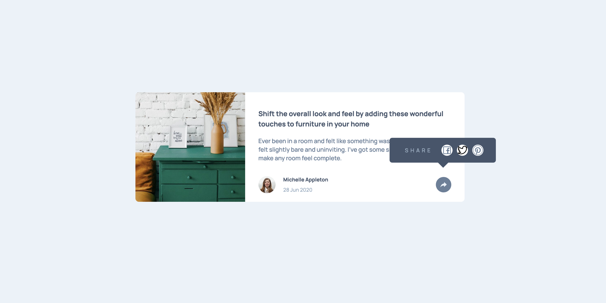
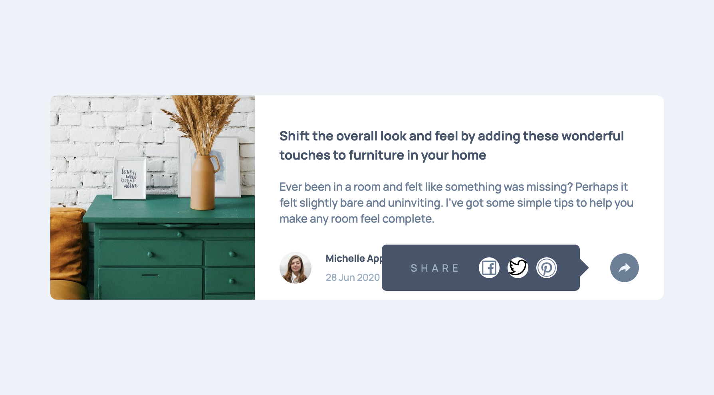
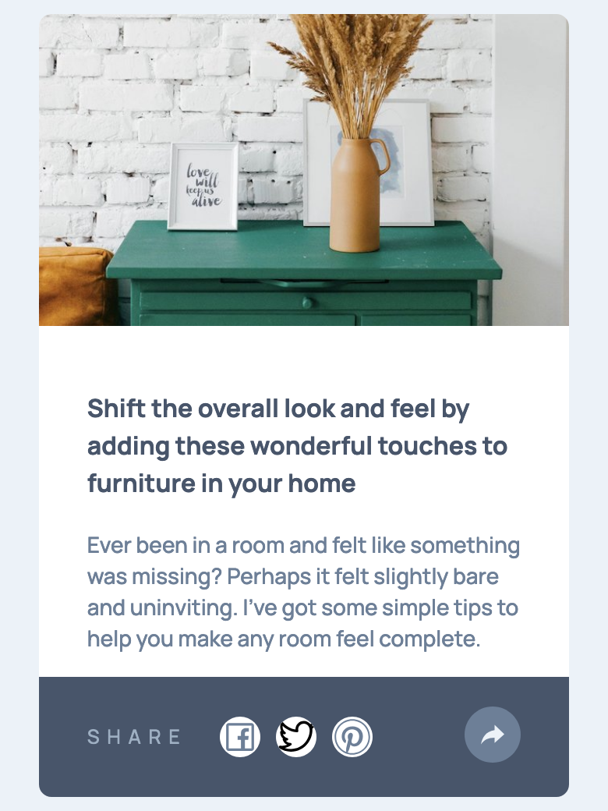

# Frontend Mentor - Article preview component solution

This is a solution to the [Article preview component challenge on Frontend Mentor](https://www.frontendmentor.io/challenges/article-preview-component-dYBN_pYFT).

## Table of contents

- [Overview](#overview)
  - [The challenge](#the-challenge)
  - [Screenshots](#screenshots)
  - [Links](#links)
- [My process](#my-process)
  - [Built with](#built-with)
  - [What I learned](#what-i-learned)
  - [Continued development](#continued-development)
  - [Useful resources](#useful-resources)
- [Author](#author)
- [Acknowledgments](#acknowledgments)

## Overview

### The challenge

Users should be able to:

- View the optimal layout for the component depending on their device's screen size
- See the social media share links when they click the share icon

### Screenshots

### Links

- Solution URL: [Add solution URL here](https://github.com/svetikbaihe/article-preview.git)
- Live Site URL: [Add live site URL here]()

## My process

### Built with

- Flexbox
- CSS Grid
- Mobile-first workflow
- Typescript
- [React](https://reactjs.org/) - JS library
- Sass
- Tailwind
- ESLint + Prettier
- Vite

### What I learned

This is my first React project, so I am definitely happy about it. 

Through this small but important project I have learned how to use different libraries such as classnames, react-responsive, react-icons step by step. 

I have learned a basic React usage without react-router, aka SPA (Single Page Application).

### Continued development

I absolutely need to contunue reading a React documentation. I have just started to work with it so there is a myriad things to practice and learn.

There is still work with the general project preparation and configuration. I guess there are some possible issues with ESLint and Prettier configurations.

### Useful resources

- [React](https://react.dev/) - Everyone who learns React should peruse this documentation.

- [Фрілансер по життю](https://fls.guru/) - This is an amazing Ukrainian web devoloper. Here you can find useful cheetsheets for flex, background, position and so on.

## Author

- Frontend Mentor - [@svetikbaihe](https://www.frontendmentor.io/profile/svetikbaihe)

## Acknowledgments

- Kudos to my mentor - [@ArtemPapusha] https://github.com/ArtemPapusha 

